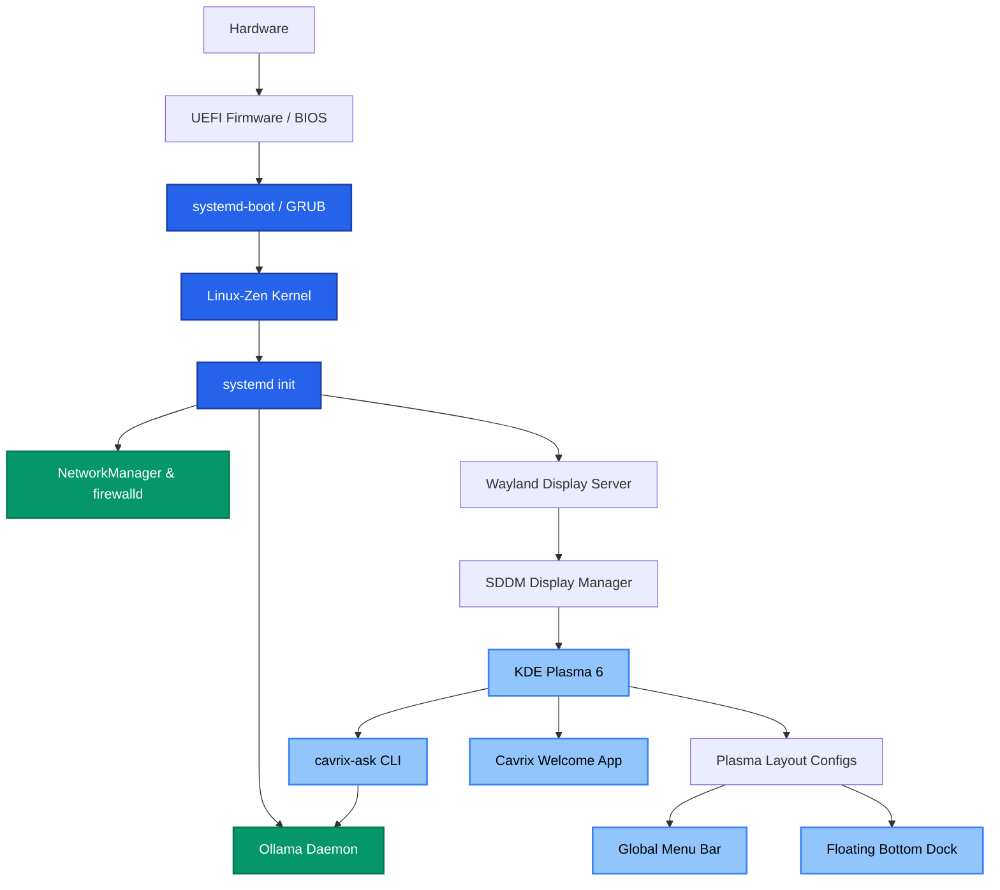

# CavrixOS Architecture

CavrixOS is an Arch Linux derivative designed to provide a pre-configured local AI environment bundled with a customized KDE Plasma desktop. It adheres to the following principles:

1. **Upstream First**: We rely on upstream repositories (Arch Linux, KDE, Ollama) for the base system and core packages. We avoid forking unless strictly necessary.
2. **Archiso Validation**: The live environment is built using standard `archiso` tooling, utilizing the `airootfs` overlay for our specific configurations.
3. **Installer Profile**: The installation process uses a custom wrapper around the official `archinstall` Python library, applying the `cavrixos_profile.py` configuration to setup the system.
4. **Local Repository Management**: Custom branding, configurations, and helper scripts (like `cavrix-ask`) are built via PKGBUILDs and hosted in a local package repository, which is included in the live ISO and installed on the target system.

## System Topology

### Core Components
- **Kernel & Init**: `linux-zen`, `systemd`, `btrfs`
- **Bootloader**: `systemd-boot` (for UEFI-ESP) or `GRUB` (legacy fallback). Boot animations provided by `Plymouth`.
- **Display Server**: `Wayland`, `KDE Plasma 6`, `SDDM`
- **Audio & Networking**: `PipeWire`, `NetworkManager`, `firewalld`
- **AI Infrastructure**: `ollama` (running globally via systemd)

## Technical Debt & Known Weaknesses

As CavrixOS rapidly evolves, several areas of technical debt and potential architectural weaknesses have been identified:

### 1. CI/CD Pipeline Fragility
The current GitHub Actions pipeline (`build-iso.yml`) relies on a monolithic Docker container (`archlinux:base-devel`) running `pacman` and `mkarchiso`.
- **Issue**: Dependency resolution and keyring initialization are frequently unstable. The pipeline lacks granular artifact caching, resulting in lengthy 3-5 minute build times per commit.
- **Resolution Path**: Refactor the pipeline into distinct, cacheable stages: Package Building, Repo Generation, and ISO Generation.

### 2. Local AI Security
Ollama currently runs as a global `systemd` service (`ollama.service`) automatically enabled upon installation.
- **Issue**: A globally accessible LLM daemon running without authentication on the local network (if bound to `0.0.0.0`) or even locally (`127.0.0.1`) poses a theoretical risk for prompt injection via local privilege escalation vectors or cross-site scripting (XSS) if a user visits a malicious site that queries `localhost:11434`.
- **Resolution Path**: Restrict Ollama's bind address strictly to UNIX sockets, or implement local authentication tokens for the `cavrix-ask` CLI.

### 3. `cavrix-ask` Simplicity
The current implementation of the `cavrix-ask` terminal assistant is a rudimentary Bash script that wraps `ollama run llama3`.
- **Issue**: It lacks context awareness, cannot read system state (e.g., `journalctl` logs), and does not parse outputs for safety before execution.
- **Resolution Path**: Rewrite `cavrix-ask` in Python or Rust, incorporating a system-context retrieval step and a confirmation dialogue before suggesting executable commands.
