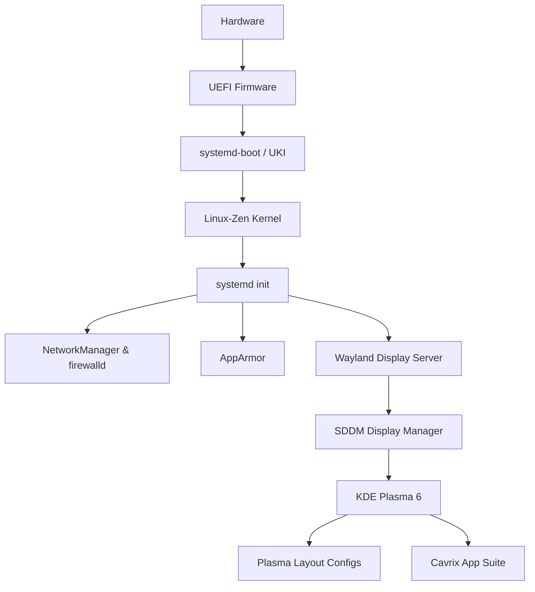

# CavrixOS Architecture Specification

This document details the system-level architecture of CavrixOS, an Arch Linux derivative.

## 1. System Topology

CavrixOS relies on upstream repositories (Arch Linux) for the base operating system and packages, utilizing local overlay repositories (`cavrix-core`, `cavrix-extra`, `cavrix-ai`) for specific distribution branding and first-party applications.

## 2. Implementation Status

### 2.1 Core Boot Chain
- **Current Implementation**: Scaffolded. The installer script `installer/src/boot/uki.py` contains logic to configure `mkinitcpio` for Unified Kernel Image (UKI) generation and `systemd-boot` installation.
- **Dependencies**: `systemd`, `mkinitcpio`, `edk2-ovmf` (for testing).
- **Validation Status**: Pending. The UKI generation script has been syntactically validated but not yet tested on physical hardware or within a full VM boot cycle.

### 2.2 Filesystem
- **Current Implementation**: Scaffolded. Btrfs is the standard filesystem. Subvolume layouts (`@`, `@home`, `@snapshots`) are implemented in `installer/src/fs/btrfs.py`.
- **Validation Status**: Pending. Integration with `grub-btrfs` or a systemd-boot equivalent for Snapper rollbacks is designed but not yet end-to-end tested.

### 2.3 Desktop Environment
- **Current Implementation**: Wayland with KDE Plasma 6. UI layout overrides (Global Menu, floating dock) are applied via Kvantum and custom Plasma JS scripting (`desktop/assets/kde/cavrixos-global`).
- **Dependencies**: `plasma-meta`, `kvantum`, `sddm`.
- **Validation Status**: Partially implemented. The assets exist, but full automated application during the `make iso` process needs integration testing.

## 3. Known Limitations & Technical Debt
- **Hardware Compatibility**: The `hwinfo` polling currently relies on basic `lspci` greps. It does not handle complex hybrid graphics setups (e.g., NVIDIA Optimus) cleanly.
- **Initramfs Bloat**: The fallback UKI is not currently optimized and includes the `autodetect` hook, which may lead to large file sizes on the ESP.
