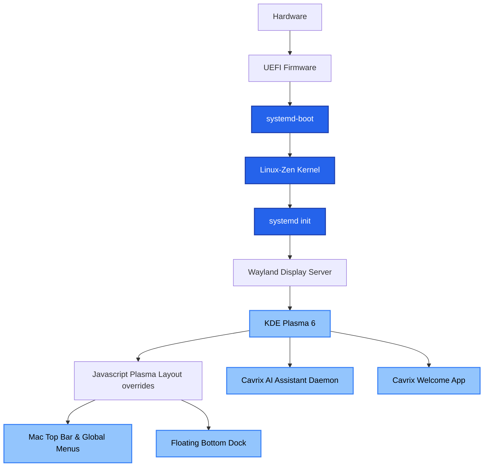

# CavrixOS Architecture

CavrixOS is a derivative built on the following principles:

1. **Upstream First**: We do not fork core packages unless absolutely necessary. We rely on the upstream repositories for the base system.
2. **Archiso**: We use standard ISO generation tools to build our live environment. Our customizations are layered via the `airootfs` overlay.
3. **Installer**: Our installer is a custom wrapper around the official `archinstall` library. We provide a pre-configured profile (`cavrixos_profile.py`) that sets up the system with our defaults.
4. **Local Repository**: We maintain a local package repository for our custom branding, configurations, and applications. This repository is included in the live ISO and configured on the installed system.

## Components

- **Base**: `linux-zen`, `systemd`, `btrfs`
- **Boot**: `systemd-boot` (UEFI) / `GRUB` (Legacy), `Plymouth`
- **Display**: `Wayland`, `KDE Plasma 6`, `SDDM`
- **Audio**: `PipeWire`
- **Networking**: `NetworkManager`, `firewalld`
- **Package Management**: `pacman`, `Flatpak` (with Flathub)
